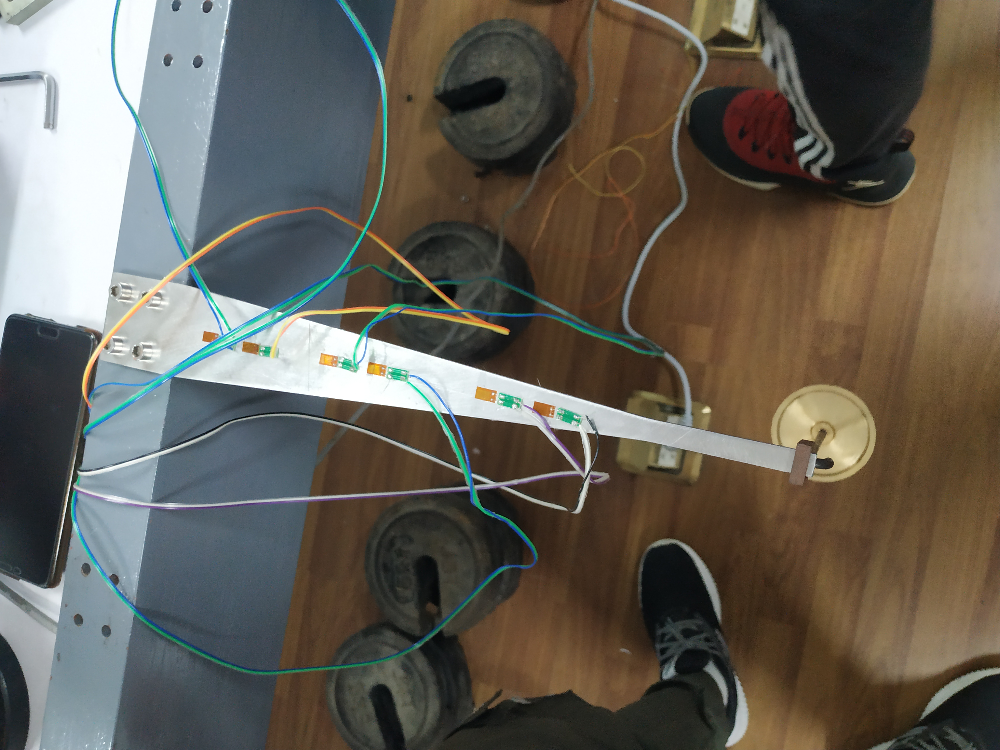
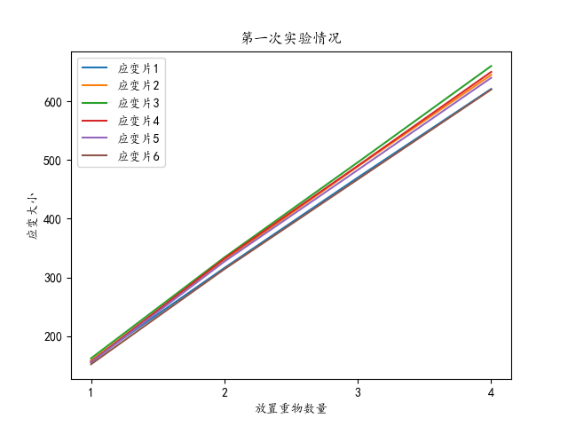

# 电阻应变片的粘贴及防潮技术实验报告

## 实验报告基本信息

- 姓名：解煚焱
- 班级：F1801005
- 学号：518021911249
- 报告按照`实验一 电阻应变片的粘贴技术.pdf`的要求撰写，要求包括：
  
  > 1. 实验目的、实验仪表及器材；
  > 2. 简述整个操作过程及注意事项；
  > 3. 实验数据(粘贴前后的应变片阻值、灵敏系数及绝缘度)；
  > 4. 若在是实验中出现问题，简单分析故障原因和排除方法；
  > 5. 思考题解答。

- 报告全部内容来自以下方式：
  1. 打字及编排（仅参考课件和课本）
  2. 图像绘制
  3. `实验一 电阻应变片的粘贴技术.pdf`的内容
- 报告其他素材可见<https://github.com/XieJiongyan/Mechanics-Experiment-strain-gage>

## 实验目的

>1. 掌握电阻应变片的选用原则和方法；
>2. 学习常温用电阻应变片的粘贴方法及过程；
>3. 学会防潮层的制作；
>4. 认识并理解粘贴过程中涉及到的各种技术及要求对应变测试工作的影响。

## 实验仪表和器材

> 1. 模拟试件（小钢板）；
> 2. 常温用电阻应变片；
> 3. 数字万用表；
> 4. 兆欧表；
> 5. 粘合剂：T-1型502胶，CH31双管胶（环氧树脂）或硅橡胶；
> 6. 丙酮浸泡的棉球；
> 7. 镊子、划针、砂纸、锉刀、刮刀、塑料薄膜、胶带纸、电烙铁、焊锡、焊锡膏等小工具；
> 8. 接线柱、短引线。

## 实验操作过程及注意事项
### 电阻应变片的选择
> 在应变片灵敏数$K$相同的一批应变片中，剔除电阻丝栅有形状缺陷，片内有气泡、霉斑、锈点等缺陷的应变片。用数字万用表的电阻档测量应变片的电阻值R，将电阻值在$120 \pm 2\Omega$范围内的应变片选出待用，记录该片的阻值和灵敏系数(应变片灵敏系数由厂家标定，本实验默认为$2.00$)。

### 试件表面的处理：
> 用锉刀和粗砂纸等工具将试件在钢板上的贴片位置的油污、漆层、锈迹、电镀层除去，再用细砂纸打磨成$45^o$交叉纹，之后用镊子镊起丙酮棉球将贴片处擦洗干净，至棉球洁白为止。

### 测点定位
> 应变片粘贴的位置及方向对应变测量的影响非常大，应变片必须准确地粘贴在结构或试件的应变测点上，而且粘贴方向必须是要测量的应变方向。本实验中假设要测定试件的中心点的轴向应变，为达到上述要求，对于钢构件，要在试件上用钢板尺和划针画一个十字线(一根长，一根短)，十字线的交叉点对准测点位置，较长的一根线要与应变测量方向一致。

### 应变片粘贴
> 1. 应变片的粘贴：
    注意分清应变片的正、反面(有引出线引出的一面为正面)，用左手捏住应变片的引线，右手上胶，在应变片的粘贴面(反面)上匀而薄地涂上一层粘结剂(502瞬间粘结剂)。待一分钟后，当胶水发粘时，校正方向(应变片的定位线与十字线交叉线对准，其电阻栅的丝绕方向与十字线中较长线的方向一致，即保证电阻栅的中心与十字交叉点对准，再垫上塑料薄膜，用手沿一个方向滚压1~2分钟即可。  
> 2. 应变片粘贴完毕后的检查：
    应变片贴好后，先检查有无气泡、翘曲、脱胶等现象，再用数字万用表的电阻档检查应变片有无短路、断路和阻值发生突变(因应变片粘贴不平整导致)的现象，如发生上述现象，就会影响测量的准确性，这时要重贴。

### 导线固定
> 由于应变片的引出线很细，特别是引出线与应变片电阻丝的连接强度很低，极易被拉断，因此需要进行过渡。导线是将应变片的感受信息传递给测试仪器的过渡线，其一端与应变片的引出线相连，另一端与测试仪器(通常为应变仪)相连接。  
> **接线柱的粘贴：**接线柱的作用是将应变片的引线与接入应变仪的导线连接上。用镊子将接线柱按在要粘贴的位置，然后滴一滴胶水在接线柱边缘，待一分钟后，接线柱就会粘贴在试件上。*(注意：接线柱不要离应变片太远，否则会使应变片的引出线与试件接触而导致应变片与试件短路。若接线柱与应变片相隔较远时，则要在引线的下面粘贴一层绝缘透明胶带，防止引出线与试件接触。)*  
> **焊接：**用电烙铁将应变片的引出线和导线一起焊接在接线柱上。  
> **焊接要点**：连接点必须用焊锡焊接，以保证测试线路导电性能的质量要求，焊点大小应均匀，不能过大，不能有虚焊。  
> **技巧一：接线柱挂锡**。电烙铁热了之后，先挂少许松香，再挂少许焊锡，然后将电烙铁在接线柱上放置$2 \sim 3$秒钟左右拿开即可。通常要求接线柱上基本挂满焊锡，如果接线柱上未能挂上焊锡或挂的焊锡较少，可再重复一次。*(注意：焊锡也不可太多，若焊锡太多流到试件上，则会引起应变片与试件发生短路现象。)*  
> **技巧二：导线挂锡**。电烙铁热了之后，先挂少许松香，再挂少许焊锡，然后将电烙铁与导线的裸露线芯的四周都接触上，整个导线挂锡就完成了。*(注意：导线挂锡一端的裸露线芯不能过长，以$3\pm 1mm$为宜。)*  
> **技巧三：引出线及导线的焊接**。先用导线挂锡的一端将应变片的引出线压在接线柱上，再把电烙铁放到接线柱上，当焊锡熔化之后立即将电烙铁移走，拿导线的手此时不能移动，$3\sim 5$秒之后，焊锡重新凝固，整个的焊接就完成了。*(注意：引出线不要拉得太紧，以免试件受到拉力作用后，接线柱与应变片之间距离增加，使引出线先被拉断，造成断路；也不能过松，以避免两引出线互碰或引出线与试件接触造成短路。焊接完成后将引出线的多余部分剪掉。)*

### 绝缘度检查
> 应变片与试件之间必须是绝缘的，否则，实际电阻就会是应变片的电阻与试件电阻的并联，从而导致测试的不准确。检查绝缘度就是用兆欧表(测量大电阻的专用仪器)检查应变片与试件之间的绝缘电阻，绝缘电阻在$50M\Omega$以上为合格，低于$50M\Omega$则用红外线灯烤至合格，若再达不到要求，则重贴。
兆欧表的使用方法：兆欧表的E端接试件，L端接应变片的引线，由慢至快地摇动仪表的手柄，指针偏转至某一位置基本不动时，读数即为绝缘电阻值。

### 制作防潮层

> 应变片在潮湿环境或混凝土中必须具有足够的绝缘度，一旦应变片受潮，其阻值就会不稳定，从而导致无法准确地测量应变，因此，在应变片贴好后，必须制作防潮层。防潮层可以用环氧树脂一份CH31A与一份CH31B混合而成，然后将配置好的防潮剂涂在应变片上(包括引线的裸露部分)，也可以用硅橡胶涂在应变片上(防潮要求不高时采用)，再用万用表和兆欧表检查一遍。防潮剂一般需固化24小时。  

*实际上在本次实验中，并没有制作防潮层。*

### 实验结果拍照

## 实验数据

第一次实验数据：

| 加载次序 | sg1 | sg2 | sg3 | sg4 | sg5 | sg6 |
| ----------------- | -- | - | - | - | - | - |
| 1                 | 158|158|162|156|155|152|
| 2       | 316 | 329 | 334 | 332 | 327 | 314 |
| 3       | 470 | 489 | 496 | 490 | 483 | 467 |
| 4       | 621 | 645 | 660 | 650 | 640 | 620 |

第二次实验数据：

| 加载次序 | sg1 | sg2 | sg3 | sg4 | sg5 | sg6 |
| ----------------- | -- | - | - | - | - | - |
| 1       | 160 | 161 | 164 | 159 | 158 | 159 |
| 2       | 313 | 318 | 324 | 313 | 315 | 308 |
| 3       | 473 | 479 | 483 | 472 | 468 | 465 |
| 4       | 625 | 637 | 647 | 634 | 624 | 614 |

| **粘贴前应变片平均阻值** | $120.34\Omega$ |
| - | - |
| **粘贴后应变片大致阻值** | $120.45\Omega$ |

**灵敏度系数**：2.00

**绝缘度**：我们对各个应变片进行了电阻检测，发现应变片与待测物件之间的电阻为$+ \infty$，即断路(*实验过程中我们询问了助教，助教表示他也不清楚，或许确实绝缘性非常好*）

## 若在实验中出现问题，简单分析故障原因和排除方法

1. 应变仪读数为0：检查是否有导线断路，导线是否相互接触等
2. 应变片脱落或损坏：清洗掉之前实验中粘贴上的应变片及接线端等等，然后重新粘贴
3. 导线焊接处脱落或导线断裂：清洗掉之前实验中粘贴上的应变片及接线端等等，然后重新粘贴
4. 某一应变片读数明显呈非线性：重新调零，加载，使用手机等重物固定导线，尽量使桌面不受很大力的作用

## 思考题

1. 为什么用电阻应变片可以测量应变?  
   *Answer*:当将电阻应变计（简称应变计）粘贴在被测构建的表面，且构件发生变形时，应变计随着构件一起变形，应变计的电阻值将发生相应的变化，通过电阻应变测量仪器（简称电阻应变仪），可测量出应变计中电阻值的变化，并换算成应变指，或者输出与应变成正比的模拟电信号（电压或电流），用记录仪记录下来，测得的结果就可以反应应变。
2. 应变片粘贴的基本原则是什么？  
   *Answer*:粘贴牢靠，无气泡、无变形、对位准确。应变仪需要加以防护。检查应变仪需要使用完好无形状缺陷的；表面处理需使表面光滑；粘贴时有若干注意事项，需保证无变形且对位准确，固化时需进行加热，之后需要检查外观。
3. 简述应变片粘贴的基本要求及其对应变测试工作的影响  
   *Answer*:粘贴牢靠，无气泡、无变形、对位准确。应变片粘贴需要至少以下步骤：检查、分选应变仪；构件测点表面处理；粘贴应变计；固化；检查；连结固定导线。如果粘贴不够牢靠，则应变计与待测物体表面有相对位移，会使测量结果偏小；如果有气泡，则一部分应变无法测量得到；若有变形，一般情况下，可以由调零解决，而如若变形量较大，则可能发生未知影响；对位不准确，将会有系统误差，包括角度引起的系统误差和中心点位置引起的系统误差。